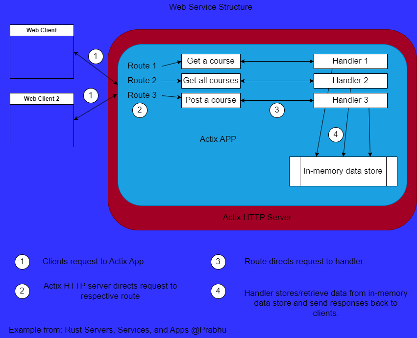

# Rust RESTful API usando Actix web framework

## Tabla de contenidos

- [Rust RESTful API usando Actix web framework](#rust-restful-api-usando-actix-web-framework)
  - [Tabla de contenidos](#tabla-de-contenidos)
  - [Acerca de](#acerca-de)
  - [Estructura](#estructura)
  - [Requisitos](#requisitos)
  - [Installing](#installing)
  - [Como usar](#como-usar)
  - [Bueno saber](#bueno-saber)

## Acerca de

La funcionalidad principal de esta API es:

1. Publicar un nuevo curso. `POST /courses`
2. Obtener la lista de cursos del tutor. `GET /courses/tutor_id`
3. Obtener detalles de un curso individual. `GET /courses/tutor_id/course_id`

## Estructura



## Requisitos

Requiere rust y cargo.

## Installing

Clona, ingresa al directorio y ejecuta lo siguiente

```bash
cargo run todo
```

## Como usar

Todo el contenido fue aprendido del libro Rust Servers, Services, and Apps de
Prabhu Eshwarla, algunas partes podrían cambiar para adaptarse a las nuevas versiones de los crates.

## Bueno saber

1. Mutex: Esta librería nos permite proteger con un 'candado' los datos compartidos entre multiples hilos
   1. Un hilo accede a un dato compartido
   2. Mutex lo bloquea para que otros hilos no intenten acceder y sucedan _condiciones de carrera_
   3. El hilo termina de trabajar con los datos y la data es liberada para que otros hilos accedan a la misma.
2. En este proyecto si queremos contar las visitas, se aplicaría Mutex para no repetir el contador sobre cada hilo.
